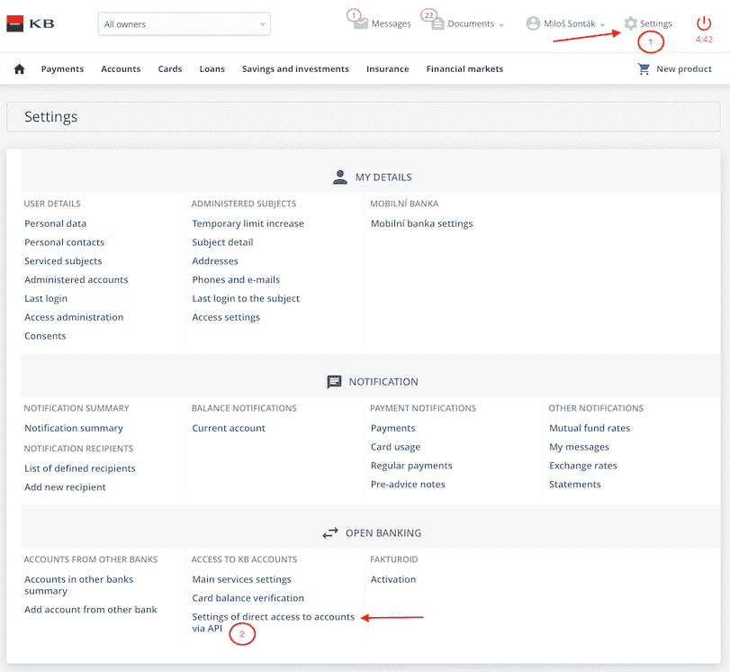

# FAQ

## How do I prolong the tokens?

### Refresh token
- After the refresh token expires, the _Client_ needs to be [Authirized](./04-Tokens#authorization-code) in _KB_'s interface again to get a new Authorization code and then get new Refresh token for the next 12 months.

### Access token
- After the access token expires, use the [Refresh token](./04-Tokens#refresh-token) to get a new Access token for the next 3 minutes.

## Where can my user (_Client_) add or change accounts usable via the API?

The _Client_ can do this in Mojebanka or Mojebanka Business:

### Mojebanka

- Mojebanka - Settings - Open banking - Settings of direct access to accounts via API

### MojeBanka Business

- Mojebanka Business - Open banking -  Access to KB accounts - Settings of direct access to accounts via API

## Error HTTP 400 Account_not_configured

- Account for this _Client_ is not authorized to be used via the API

## Unique id transactions
