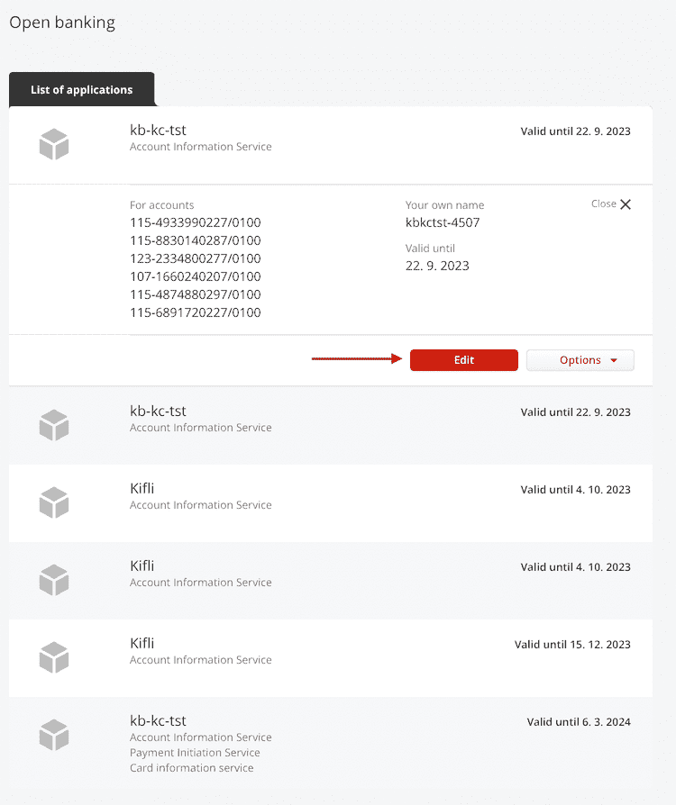

# FAQ

## How prolong tokens?

- after expiration refesh token, you can call [authirozation](./Tokens#authorization-code) to get new refresh token for next 12 months

## Where a user can add or change accounts for the API

The client can do this in Mojebanka or Mojebanka Business:

### Mojebanka

- Mojebanka - Settings - Open banking - Settings of direct access to accounts via API

### MojeBanka Business

- Mojebanka Business - Open banking -  Access to KB accounts - Settings of direct access to accounts via API

## Error HTTP 400 Account_not_configured

- Account for this client is not configured as selected

## Unique id transactions