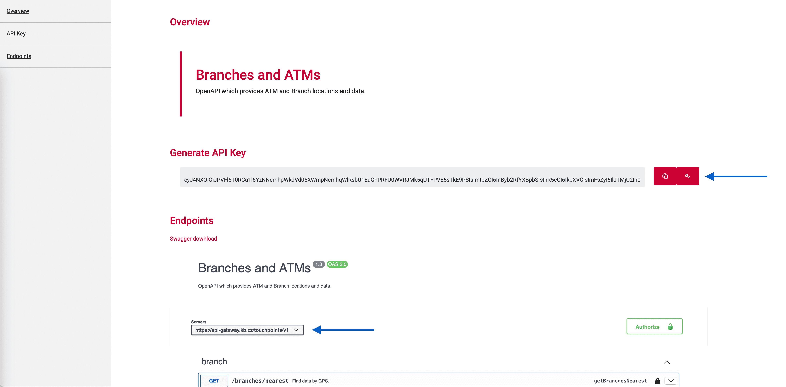

# What you need to do

 ## Instructions for API business suite (ADAA - Account direct Access API)

## 1. Login in the new API portal

- Login to portal <https://developers.kb.cz> - you can use username and password from the old API Portal.

## 2. New Client registration (Software statements) v2

- Rename the header x-api-key to apiKey.
- Generate new apiKey and put your app.
- Mandatory section contacts.email.
- New url: <https://client-registration.api-gateway.kb.cz/v2>.
- v1 will be operational until 31.1.2024.

## 3. Registration OAuth2 client

- New url: <https://api-gateway.kb.cz/client-registration-ui/v1/saml/>

## 4. New OAuth2 v2

- Mandatory and rename the header x-api-key to apiKey.
- Generate new apiKey and put your app.
- New url: <https://api-gateway.kb.cz/oauth2/v2>.
- v1 will be operational until 31.1.2024.

## 5. Account direct access v1

- Rename the header x-api-key to apiKey.
- Generate new apiKey and put your app.
- New url: <https://api-gateway.kb.cz/adaa/v1>.
- Terminate the endpoint /account-ids → replaced by /accounts,
  - the endpoint /account-ids will be operational until 31.1.2024.

##  Instructions for other APIs (Exchange Rates, Branches and ATMs, Contact Requests, etc.)

## 1. Login in the new API portal

- Login to portal <https://developers.kb.cz> - you can use username and password from the old API Portal.

## 2. Open API and create apiKey

- Rename the header x-api-key to apiKey ("x-api-key" will no longer work).
- Generate new apiKey and replace it in your app.
- Copy new url (replace old one in your app).

